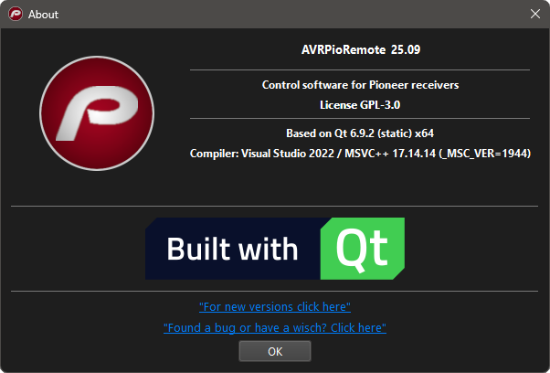
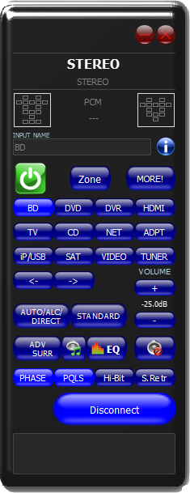
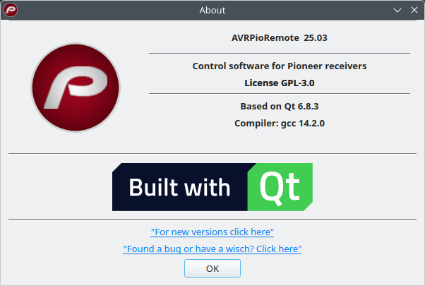

# AvrPioRemote. Based on Qt 5.15

This is clone of https://sourceforge.net/projects/avrpioremote/

With this software you are able to control your Pioneer receiver from your PC.
The software is developed for the year 2012 devices, but some features may work with older receivers. Tested with VSX-922, SC-2022 and LX-56.
Update 2018: Now the new generation is supported too (like LX-701)

From now supported both versions of QT

 Cooming soon
 | QT5 | QT 6 |
 :-------------------------:|:-------------------------:
 | 
 
 | | |
:-------------------------:|:-------------------------:
 |  

